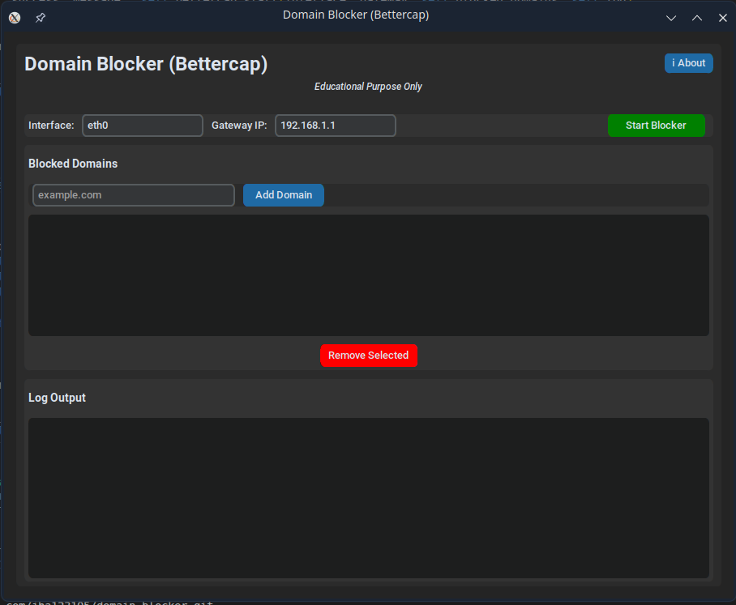

# Domain Blocker (Bettercap)

A modern GUI tool for blocking domains on a local network using Bettercap's ARP spoofing and HTTP/HTTPS proxy features. Built with Python and CustomTkinter.


---

## Educational Purpose Only

> ⚠️ This project is intended strictly for educational purposes and authorized testing on networks you own or have explicit permission to assess.
>
> Unauthorized traffic interception, ARP spoofing, or network manipulation may violate laws, regulations, or organizational policies.

---

## Overview

Domain Blocker allows you to block access to selected domains for devices on a local network by using Bettercap as a proxy and network interception platform.

The application uses ARP spoofing to position itself between devices and the gateway, then filters HTTP and HTTPS requests. Requests to blocked domains are denied with a `403 Forbidden` response.

**Developed by:** Yushie_Alya1

---

## Features

- 🚦 **Start/Stop Blocking** – Enable or disable domain blocking with a single click
- ➕ **Add/Remove Domains** – Manage blocked domains with persistent JSON storage
- 🔒 **HTTP/HTTPS Filtering** – Block domains using Bettercap proxy scripting
- 📝 **Real-Time Logs** – View live Bettercap and application output inside the GUI
- 🎨 **Modern GUI** – Dark-mode interface built with CustomTkinter
- 💾 **Persistent Storage** – Blocked domains are automatically saved between sessions

---

## Requirements

### System Packages (Ubuntu / Debian / Mint)

```bash
sudo apt update
sudo apt install bettercap python3-tk
```

---

### Python Packages

Create and activate a virtual environment:

```bash
python3 -m venv venv
source venv/bin/activate
```

Install dependencies:

```bash
pip install customtkinter
```

or:

```bash
pip install -r requirements.txt
```

---

## Installation & Usage

### 1. Clone the Repository

```bash
git clone https://github.com/jha123105/domain-blocker.git
cd domain-blocker
```

---

### 2. Create a Virtual Environment

```bash
python3 -m venv venv
```

---

### 3. Activate the Environment

```bash
source venv/bin/activate
```

---

### 4. Install Dependencies

```bash
pip install -r requirements.txt
```

---

### 5. Run the Application

Using the launcher script:

```bash
./launch.sh
```

or directly:

```bash
sudo python3 main.py
```

> Root privileges are required for Bettercap and ARP spoofing functionality.

---

## How to Use

1. Enter your network interface  
   Example:
   - `eth0`
   - `wlan0`

2. Enter your gateway IP address  
   Example:
   - `192.168.1.1`

3. Add domains using the input field and **Add Domain** button

4. Click **Start Blocker** to begin interception and filtering

5. Monitor live log output in the GUI

6. Click **Stop Blocker** when finished

---

## Screenshot




---

## Project Structure

```text
domain-blocker/
├── main.py
├── core/
│   ├── bettercap_controller.py   # Bettercap process management
│   └── domain_manager.py         # Blocked domain storage
├── utils/
│   └── logger.py                 # Logging utilities
├── screenshots/
│   └── main-window.png
├── requirements.txt
├── launch.sh
└── README.md
```

---

## How It Works

### ARP Spoofing

Bettercap sends forged ARP responses to the gateway and connected devices, positioning the attack machine as a man-in-the-middle proxy.

### HTTP/HTTPS Proxying

Bettercap intercepts network requests through its built-in proxy system.

### Domain Filtering

A Bettercap JavaScript proxy script checks requested hosts against the blocklist. Matching domains receive a `403 Forbidden` response.

### Persistent Blocklist

Blocked domains are stored inside:

```text
blocked_domains.json
```

and automatically reloaded during startup.

---

## Troubleshooting

### Bettercap Not Found

Install Bettercap:

```bash
sudo apt install bettercap
```

---

### Permission Denied

Run the application with root privileges:

```bash
sudo python3 main.py
```

---

### No Traffic Is Being Blocked

Verify:
- Correct network interface
- Correct gateway IP
- Devices are on the same local network

To check the gateway:

```bash
ip route
```

---

### HTTPS Sites Still Accessible

Bettercap's HTTPS proxy relies on a self-signed certificate. Browsers may warn users before allowing interception.

This behavior is expected during testing environments.

---

## Contributing

Issues and pull requests are welcome.

For major changes, please open an issue first to discuss proposed modifications.

---

## Legal Disclaimer

This tool is intended strictly for educational purposes and authorized security testing.

You must have explicit written permission from the network owner before performing ARP spoofing or traffic interception. Unauthorized use may violate local, national, or international laws.

The developer assumes no responsibility or liability for misuse of this software.

---

## License

This project is licensed under the **MIT License**.  
See the `LICENSE` file for more information.

---

## Author

**Yushie_Alya1**

GitHub: `@YushieAlya1`
